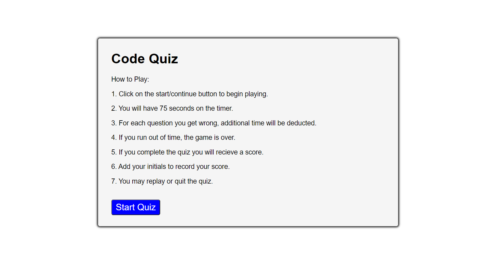

# Code Quiz: Timer & Score Card

## Project Description

Build a timed coding quiz with multiple-choice questions. This app will run in the browser and will feature dynamically updated HTML and CSS powered by JavaScript code. It will have a clean, polished, and responsive user interface. 

## Main Objective

Complete an assessment from scratch that uses interactive coding & multiple-choice questions similar to ones that are used in the interview process.

## Items completed in Project

✅Create a interactive coding quiz with a start button & timer.

✅Timer starts when presented with a question. When question is answered another question is presented.

✅When question is answered incorrectly, time is subtracted from the clock.

✅When all questions are answered or the timer reaches 0. The game is over.

✅Once game is over player enters initials to the save the high score before resetting and starting over.

✅Repository contains multiple descriptive commit messages, contains a README with a link to deployed project, and Screenshot.

## Live URL
https://cynthiagodoy.github.io/Code-Quiz/

## Screenshot

